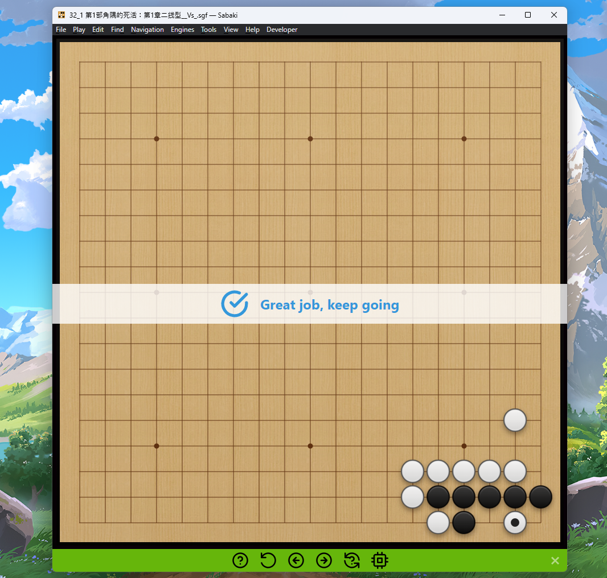

# 

## Features

- Original Sabaki features unchanged
- Added fully functional tsumego mode
- Tsumego hints
- Tsumego auto response
- Random rotation
- Answer check and visual feedback
- Quick navigation to next/previous problem and reset
- Modified manage games to tsumego library with random sort

[Download Here]https://github.com/kangyio/Sabaki_Tsumego/releases/tag/Publish

## How to use

- Add Tsumego Problems
Click 'File' - 'Manage Tsumego' - 'Add' (bottom left) - 'Add Existing Files...' (add multiple tsumego sgf files)

- Enable Tsumego Mode
Click 'Tools' -  'Toggle Tsumego Mode' - Enjoy solving tsumego problems!
